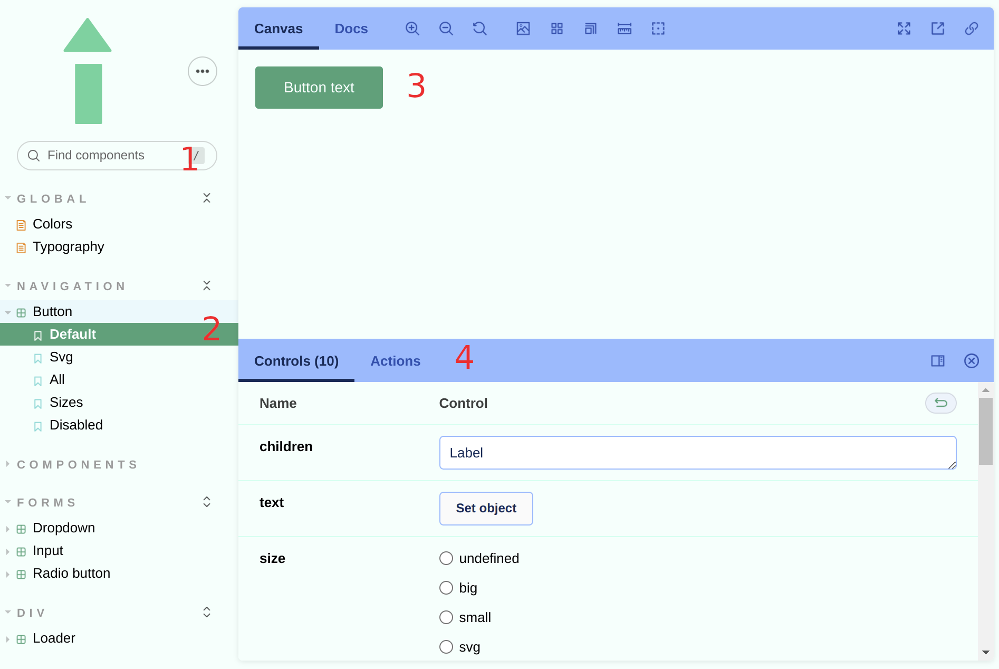
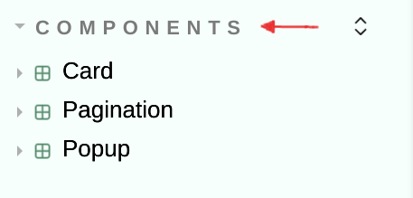
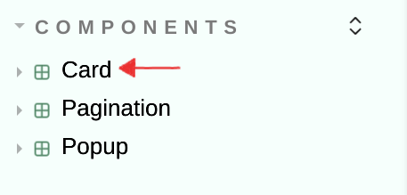
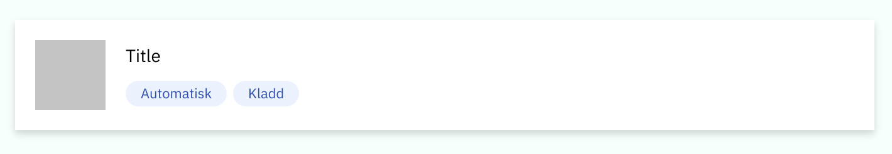

# Velkommen til innbyggerkontakt sin designsystem!

**Innholdsfortegnelse**
| Link | Beskrivelse |
| - | - |
| [Start Storybook](#start-storybook) | Hvordan man starter opp prosjektet og kjapp forklaring av nettsiden |
| [Utvikling](#utvikling) | Forklaring på hvordan mappestrukturen er foreløpig og hva stories er |
| [Stories](#stories) | Forklaring på hva stories er og hvordan de skal vises i [sidemenyen](#display-i-menyen). Der får man også forklart hvordan filen for [forhåndsvising](#forhåndsvisning) er strukturert. |
| [Accessibility](#accessibility) | Forklaring på accessibility testing i storybook |


This project was bootstrapped with [Create React App](https://github.com/facebook/create-react-app).

*Innbyggerkontakt er skrevet med typsecript og derfor skal alle komponentene i storybook være typed.*

## Start Storybook
For å starte prosjektet kjør ```yarn storybook```. Den skal starte på ```localhost:6006```.

Nå har du siden kjørende og ser noe som ligner på dette:
 
 | 1. Søk | 2. Sidemeny | 3. Display | 4. Props |
 | - | - | - | - |
 | Her kan du søke på komponentene som har stories. | I sidemenyen ser du underkategoriene til komponentene som f.eks. "navigation". Der kan du finne alle komponenter som tilhører kategorien. | Her vises komponenten frem. Her kan du trykke, resize og generelt prøve ut komponenten og dens oppførsel. | Controls har oversikt over alle props som komponenten har. Her kan du fylle ut de ulike propsene og se hvordan komponenten kommer til å endre seg. |
 | - |  Under komponenten kan du se ulike variasjoner av den som f.eks "size". Der demonstreres ```size``` prop og hvordan den påvirker komponenten. | I menyen over har man ulike innstillinger som f.eks bakgrunnsfarge, grid med mål og docs for å se hvordan komponenten brukes. | På bildet kan du f.eks se at man kan velge ```size``` og at den har 3 typer størrelse: big, small og svg. |

## Utvikling

Det å lage komponenter i storybook er ikke noe forskjellig fra vanilla react. 
Alle komponentene ligger i ```/components``` mappen. Tittelen på filen skal være det samme som navnet til komponenten.
Dersom stylingen skal være påvirket av props så det det lettest å holde styling og koden til komponenten i samme fil. 
Der kan du også lage egendefinerte props og styling. 
Gode og enkle eksempler er ```RadioButton``` og ```Button```.  
## Stories
For å se din komponent i Storybook må du lage ```**.stories.[tsx, mdx]``` aka en story. I denne filen kan du vise ulike props og deres virkning på komonenten. 
Hvordan du skal bestemme om hvilke stories er lurt å lage finner du i denne artikkelen [her](https://storybook.js.org/blog/testing-composite-components/).

I dette avsnittet skal vi dekonstruere ```Card``` story filen.
```
import React from 'react';
import {Card} from '../components/Card';

export default {
     title: "Components/Card",
     component: Card
 }

 export const Default = (args) => <Card {...args}/>

 export const Sizes = () => 
    <div>
        <Card size="small" title={'title'} image={''} lastChanged={''} bulletinType={'event'} bulletinStatus={'draft'}/>
        <Card size="large" title={'title'} image={''} lastChanged={''} bulletinType={'event'} bulletinStatus={'draft'}/>
    </div>
```

#### Display i menyen  

Første delen av filen er tittel og underkategori som blir vist i menyen ([punkt 2](public/storybook.png)):
```
export default {
     title: "Components/Card",
     component: Card 
 }
 ```
 Her er det 2 som er viktig; ```title``` og ```component``` 
``` 
title: "Components/Card 
```  
| title: "*Components*/** " | title: "**/*Card* " | component: Card |
| - | - | - |
| Underkategorien som komponenten skal ligge under | Navnet på komponenten som vises i menyen | Komponenten som blir importet og skal vises frem |
|  |  |  |

#### Forhåndsvisning
Etter at man lager tittlen og importerer komponenten i filen som vises i sidemenyen skal vi vise den frem i Canvas ([punkt 3](public/storybook.png)).
``` 
 export const Default = (args) => <Card {...args}/>
 ``` 
Underkapittelet til butten kommer nå til å hete ```Default```. Her vil komponenten få alle props med default verdier.

``` 
 export const Sizes = () => 
    <div>
        <Card size="small" title={'title'} image={''} lastCehanged={''} bulletinType={'event'} bulletinStatus={'draft'}/>
        <Card size="large" title={'title'} image={''} lastChanged={''} bulletinType={'event'} bulletinStatus={'draft'}/>
    </div>
```
Her vil underkapittelet til ```Card``` være ```Sizes``` og de får inn andre verdier  enn de som er default i props og man kan se hvordan komponenten vil se ut dersom man endrer ```size``` prop.

Dersom du vil lese mer om hvordan man kan manipulere eller endre visningen av props i stroybook besøk [Storybook args](https://storybook.js.org/docs/react/writing-stories/args)

## Accessibility
I samme panelet som props skal det være en tab kalt "Accessibility. Storybook har en a11y addon som kjører [Axe](https://github.com/dequelabs/axe-core). Den skal finne rundt 57% av WCAG feil automatisk. 

*Utvidelsen på WCAG sjekk burde skje så fort som mulig*

## Todo
- [ ] [Jest tester](https://storybook.js.org/blog/testing-component-interactions/)
- [ ] [ Accessibility tester](https://storybook.js.org/blog/accessibility-testing-with-storybook/)
